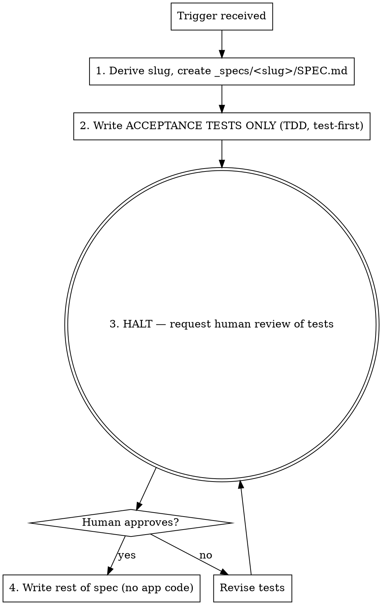

# Spec-Driven Development

## Overview

Turn a feature idea into a reviewed, test-anchored specification — **never** into application code. The spec is the contract; acceptance tests are written *first* and *reviewed by a human* before the rest of the spec is fleshed out.

**Core principle:** Acceptance tests come first. A human approves them. Only then do you write the rest of the spec. The spec contains zero application code.

## When to Use

Trigger on phrases like:
- "spec out ..."
- "write a spec for ..."
- "generate a spec ..."
- "draft a spec ...", "specify ...", "let's spec ..."

**When NOT to use:** implementation requests ("build it", "code this up", "implement X"), bug fixes, or when an approved SPEC.md already exists and the user wants tasks — hand off to task-breakdown instead.

## Output Location

**One folder per work item.** Always:

```
_specs/<slug>/SPEC.md
```

- `<slug>` is a short, kebab-case name derived from the work item (e.g. `url-shortener`, `oauth-login`).
- Never write to `_spec/`, `spec.md`, the repo root, or any other path.
- Never collapse multiple work items into one file.

## The Workflow (MANDATORY ORDER)



### Step 1 — Create the file
Derive the kebab-case slug and create `_specs/<slug>/SPEC.md` with a title and an `## Acceptance Tests` section. Nothing else yet.

### Step 2 — Acceptance tests FIRST (TDD)
Write the acceptance tests before any other spec content. Each test:
- Describes **observable behavior**, not implementation.
- Is concrete and verifiable: Given / When / Then, or a clear input → expected output.
- Is numbered (AT-1, AT-2, …) so review and later tasks can reference it.
- Covers the happy path **and** edge/error cases.

These are tests, not prose requirements. They define "done."

### Step 3 — HALT for human review (HARD STOP)
After writing the acceptance tests, **stop and request human review.** Do not write the rest of the spec. Present the tests and ask the human to approve or revise. Wait for explicit approval.

This is a gate, not a suggestion. You may not proceed to Step 4 on your own judgment.

### Step 4 — Write the rest of the spec
Only after approval, fill in the remaining sections. Still **no application code.**

## SPEC.md Structure

```markdown
# <Work Item Title>

## Acceptance Tests        <!-- written FIRST, reviewed FIRST -->
- AT-1: Given ... When ... Then ...
- AT-2: ...

<!-- everything below is written ONLY after tests are approved -->

## Summary
## Users & Use Cases
## In Scope / Out of Scope
## Functional Requirements   <!-- each maps to one or more AT-n -->
## Non-Functional Requirements
## Data Model                <!-- shapes/fields, NOT code -->
## Constraints & Assumptions
## Open Questions
```

## No Application Code — Ever

The spec describes **what** and **how it's verified**, never **how it's built**.

- ❌ No functions, classes, route handlers, SQL, config files, or runnable snippets.
- ❌ No "here's a starter implementation."
- ✅ Data models as field tables or shape descriptions, not type/class definitions.
- ✅ Acceptance tests as behavioral specs (Given/When/Then), not test-runner code.

If you catch yourself writing a code block that could be copy-pasted into the app, stop and rewrite it as a behavioral statement.

## Common Mistakes

| Mistake | Fix |
|---------|-----|
| Wrote to `_spec/spec.md` or repo root | Use `_specs/<slug>/SPEC.md`, one folder per item |
| Wrote the whole spec in one pass | Tests first, then HALT, then the rest |
| Folded acceptance criteria inline and skipped the gate | Acceptance tests are a distinct first section + review gate |
| Skipped human review "to save a round-trip" | The halt is mandatory; wait for approval |
| Put code/SQL/types in the spec | Describe behavior and data shapes in prose/tables |
| Started implementing after approval | This skill ends at the spec; implementation is separate |

## Red Flags — STOP

- About to write Summary/Requirements before tests exist → write tests first.
- About to continue past the tests without asking the human → HALT and request review.
- About to paste a runnable code block → it's a spec, not code.
- About to use any path other than `_specs/<slug>/SPEC.md` → fix the path.
